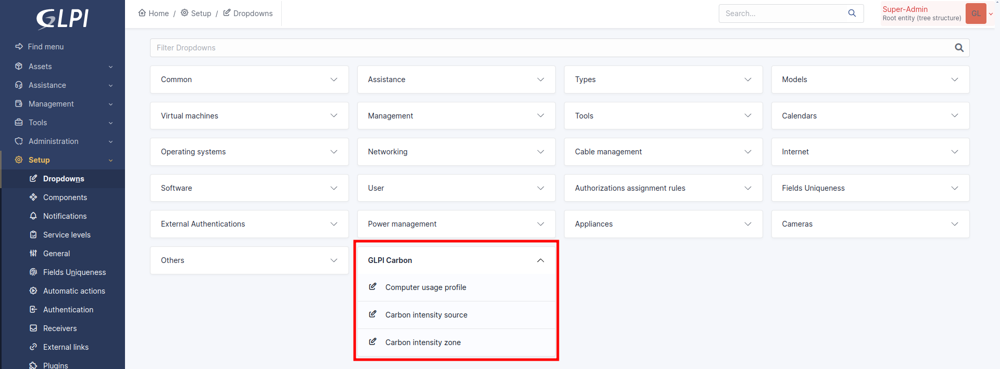
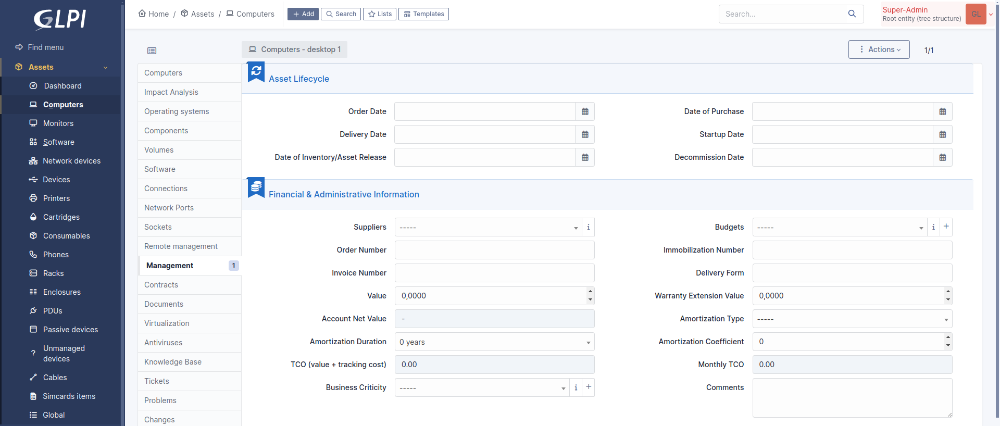
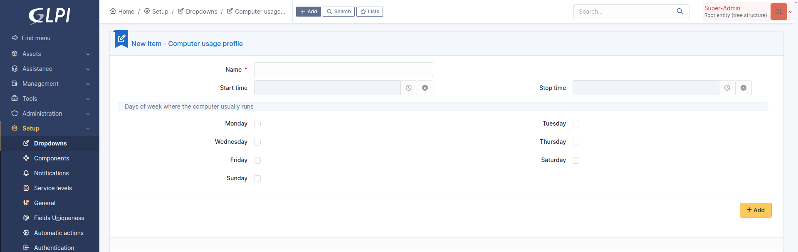

Configuration
=============

Automatic actions
-----------------

The plugin requires a working configuration of `automatic actions with CLI mode <https://glpi-user-documentation.readthedocs.io/fr/master/modules/configuration/crontasks.html>`_.
Check carefully that GLPI scheduler is running every minute.

Downloading carbon intensitiy data
^^^^^^^^^^^^^^^^^^^^^^^^^^^^^^^^^^

The plugin implements an automatic action for each data provider. Supported sources are
* **RTE** for France (free, data back to 2012-01-01)
* **Electricity Map** for most countries and regions in the world (free access limited to last 24 hours)

When an automatic action runs for the first time it setups supported regions in database. Once done, you may activate downloads for regions of interest.

Enable / disable carbon intensity data download
-----------------------------------------------

Navigate in GLPI to **Setup > Dropdowns > box GLPI Carbon > Carbon intensity sources**, select a data provider. open the tab **Carbon intensity zones**. Find the country y want to check or set. Toggle the flag **Download enabled** by clicking on its status

.. note::
    If the list of regions or countries is empty then you need to run the automatic action of this source first.

Inventory requirements
----------------------

All assets
^^^^^^^^^^

To calculate the emission of greenhouse gas related to energy consumed during use of your assets, the plugin needs to know when an asset is used for the first time and when its services is stopped.

To do so, the plugin seearches for the following dates on order of decreasing precedence:
* **startup date** (Financial and administrative informations)
* **delivery date** (Financial and administrative informations)
* **date of purchase** (Financial and administrative informations)
* **creation date in inventory**
* **modification date in inventory**

The plugin needs to know where is an asset to determine which carbon intensity is applied to its energy consumption. The associated location mist have the field **Country** filled

Computers
^^^^^^^^^
Computers are usually powered on depending on working days and hours. You msut tell when computers are turned on in their tab **Environnemental impact**. In this place you can assign a usege profile which describes how the computers are powered on.

To create an usage profile, go in **Setup > Dropdowns > box GLPI Carbon > Computer usage profiles**.

Monitors
^^^^^^^^

Network equipments
^^^^^^^^^^^^^^^^^^